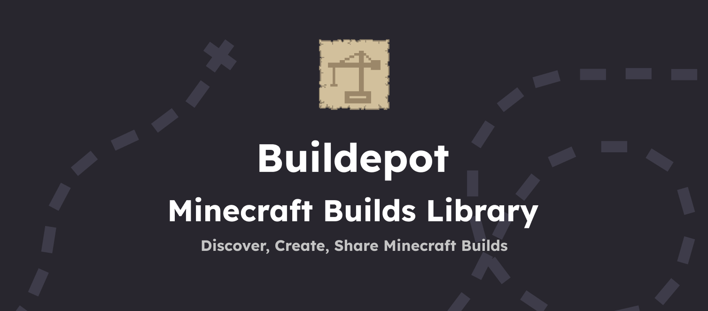

<center>
   

   <!--[](https://twitter.com/Buildepot) [](https://discord.gg/your-discord-link) [](https://github.com/your-username/buildepot)
   TBA -->
   **Buildepot** is a community-driven platform inspired by [Modrinth](https://modrinth.com/), designed for Minecraft players to share their world saves, maps, and builds. With a focus on simplicity and performance, Buildepot helps players easily discover and share Minecraft creations.
</center>

## Features

While the website is still in very early development, the features that are planned are:

- **World Sharing**: Upload, share, and discover amazing Minecraft world saves, maps, and builds.
- **User Profiles**: Create and customize your profile to showcase your contributions.
- **Categories & Tags**: Easily categorize your builds, making it simple for others to find inspiration.
- **Rating System**: Rate and comment on other users' submissions.

## Technology Stack

- **Frontend**: [Svelte](https://svelte.dev/)
- **Backend**: [SvelteKit](https://kit.svelte.dev/)
- **Storage**: [AWS S3](https://aws.amazon.com/s3/) (for storing world files and assets)
- **Database**: [PostgreSQL](https://www.postgresql.org/) (for user and build data)
- **Language**: [TypeScript](https://www.typescriptlang.org/)

## Setup and Installation

To get started with Buildepot locally:

1. **Clone the Repository**
   ```sh
   git clone https://github.com/your-username/buildepot.git
   cd buildepot
   ```

2. **Install Dependencies**
   ```sh
   npm install